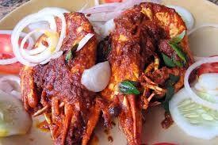

# Ex.07 Restaurant Website
## Date:17/10/25

## AIM:
To develop a static Restaurant website to display the food items and services provided by them.

## DESIGN STEPS:

### Step 1:
Requirement collection.

### Step 2:
Creating the layout using HTML and CSS.

### Step 3:
Updating the sample content.

### Step 4:
Choose the appropriate style and color scheme.

### Step 5:
Validate the layout in various browsers.

### Step 6:
Validate the HTML code.

### Step 7:
Publish the website in the given URL.

## PROGRAM:
```
first.html
<!DOCTYPE html>
<html lang="en">
<head>
    <meta charset="UTF-8">
    <meta name="viewport" content="width=device-width, initial-scale=1.0">
    <title>Santhosh kumar s-25017512</title>
    <link rel="stylesheet" href="first-style.css">
</head>
<body>
    <header>
        <h1>white dragon</h1>
        <nav>
             <ul>
                <li><a href="index.html">Home</a></li>
                <li><a href="menu.html">Menu</a></li>
                <li><a href="team.html">Our Team</a></li>
                <li><a href="contact.html">Contact Us</a></li>
            </ul>
        </nav>
    </header>

    <main>
        <section class="hero-section">
            <div class="hero-content">
                <h2>Welcome to great </h2>
                <p>classic flavors in unexpected new states.</p>
                
            </div>
        </section>

        <section class="info-cards">
            <div class="card">
                <h3>View The Menu</h3>
                
                <a href="menu.html">Explore our creations</a>
            </div>
            <div class="card">
                <h3>Reserve Your Table</h3>
                <p>Secure your spot for a truly unique and memorable dining event.</p>
                <a href="contact.html">Book your reservation</a>
            </div>
        
            </div>
        </section>
    </main>

    <footer>
        <p>© 2025 white dragon | Developed by santhoshkumar s </p>
    </footer>
</body>
</html>

menu.html
<!DOCTYPE html>
<html lang="en">
<head>
    <meta charset="UTF-8">
    <meta name="viewport" content="width=device-width, initial-scale=1.0">
    <title>White Dragon - Menu</title>
    <link rel="stylesheet" href="style-menu.css">
</head>
<body>
    <header>
        <div class="header-content">
            <h1>White Dragon</h1>
            <nav>
                <ul>
                    <li><a href="first.html">Home</a></li>
                    <li><a href="menu.html">Menu</a></li>
                    <li><a href="team.html">Our Team</a></li>
                    <li><a href="contact.html">Contact Us</a></li>
                </ul>
            </nav>
        </div>
    </header>

    <main class="menu-container">
        <div class="menu-grid">
            <div class="menu-item">
                
                <h4>chicken piece</h4>
                <p class="description">freshely prepared !!!</p>
                <p class="price">Price: RS.200/-</p>
            </div>
            <div class="menu-item">
                
                <h4>Deconstructed Caesar</h4>
                <p class="description">Romaine, Parmesan foam, and crispy croutons presented in separate states.</p>
                <p class="price">Price: RS.550/-</p>
            </div>
            <div class="menu-item">
                
                <h4>Prime Beef Wellington</h4>
                <p class="description">mushroom duxelles and flaky pastry.</p>
                <p class="price">Price: RS.700/-</p>
            </div>
            <div class="menu-item">
                
                <h4>White Truffle Risotto</h4>
                <p class="description">Creamy Italian Arborio rice with shaved white truffle and aged Pecorino.</p>
                <p class="price">Price: RS.280/-</p>
            </div>
            <div class="menu-item">
                
                <h4>DHOSA</h4>
                <p class="description">healty dinner food</p>
                <p class="price">Price: RS.50/-</p>
            </div>
            <div class="menu-item">
                
                <h4>Compressed Chocolate Cube</h4>
                <p class="description">A dense cube of dark chocolate mousse, ganache, and cocoa nibs.</p>
                <p class="price">Price: RS.650/-</p>
            </div>
        </div>
    </main>

    <footer>
        <p>© 2025 White Dragon | Developed by santhosh kumar s</p>
    </footer>
</body>
</html>
team.html
team.html
<!DOCTYPE html>
<html lang="en">

<head>
    <meta charset="UTF-8">
    <meta name="viewport" content="width=device-width, initial-scale=1.0">
    <title> - Our Team</title>
    <link rel="stylesheet" href="team-style.css">
</head>

<body>
    <header>
        <div class="header-content">
            <h1>White Dragon</h1>
            <nav>
                <ul>
                    <li><a href="index.html">Home</a></li>
                    <li><a href="menu.html">Menu</a></li>
                    <li><a href="team.html">Our Team</a></li>
                    <li><a href="contact.html">Contact Us</a></li>
                </ul>
            </nav>
        </div>
    </header>

    <main class="team-container">
        <h2>Our Culinary Engineers</h2>
        <div class="team-grid">
            <div class="team-member">
                <div class="profile-image">
                    
                </div>
                <h4>Mr SanthoshKumar s</h4>
                <p>Executive Chef & Founder</p>
            </div>
            <div class="team-member">
                <div class="profile-image">
                    
                </div>
                <h4>Mr sachin</h4>
                <p>Sous Chef / Molecular Specialist</p>
            </div>
            <div class="team-member">
                <div class="profile-image">
                    
                </div>
                <h4>Mr Jeeva</h4>
                <p>Pastry & Dessert Alchemist</p>
            </div>

        </div>
    </main>

    <footer>
        <p>© 2025 White Dragon | Developed by SanthoshKumar-25017512</p>
    </footer>
</body>

</html>
contant.html
<!DOCTYPE html>
<html lang="en">
<head>
    <meta charset="UTF-8">
    <meta name="viewport" content="width=device-width, initial-scale=1.0">
    <title>Quantum Kitchen - Contact Us</title>
    <link rel="stylesheet" href="content-style.css">
</head>
<body>
    <header>
        <div class="header-content">
            <h1>White Dragon</h1>
            <nav>
                <ul>
                    <li><a href="first.html">Home</a></li>
                    <li><a href="menu.html">Menu</a></li>
                    <li><a href="team.html">Our Team</a></li>
                    <li><a href="contact.html">Contact Us</a></li>
                </ul>
            </nav>
        </div>
    </header>

    <main class="contact-info">
        <h2>Contact & Reservations</h2>
        <p>Location: No.11,Lenin nagar,salem-637302</p>
        <p>Phone: +91 8072481818</p>
        <p>Email: jeevanivas420@gmail.com</p>
        <p>Catering Inquiries: sachin120508@gmail.com</p>
    </main>

    <footer>
        <p>© 2025  White Dragon | Developed by SanthoshKumar-25017512</p>
    </footer>
</body>
</html>
first-style.css
body {
    font-family: Arial, sans-serif;
    margin: 0;
    padding: 0;
    color: #fff; 
    background-color:#ffd700;
    text-align: center;
    overflow-x: hidden; 
}

header {
  
    height: 10vh; 
    background-color: #4a4a4a;
    padding: 1vh 0; 
    color: #fff;
    display: flex; 
    flex-direction: column;
    justify-content: center;
}

h1 {
    font-size: 1.5em; 
    margin: 0;
    color: #e7dfaf;
}

nav ul {
    list-style: none;
    padding: 0;
    margin: 0;
    display: flex;
    justify-content: center;
    gap: 20px;
}

nav a {
    color: #fff;
    text-decoration: none;
    font-weight: bold;
    font-size: 0.8em; 
    padding: 0;
}


.hero-section {
   
    height: 55vh; 
    
   
    background: url("backgoundmenu.jpeg")no-repeat center center/cover;
    
    display: flex;
    align-items: center; 
    justify-content: center; 
    
    text-shadow: 1px 1px 5px rgba(0, 0, 0, 0.8);
}

.hero-content {
  
    background-color: rgba(0, 0, 0, 0.7); 
    padding: 3vh 5vw; 
    border-radius: 10px;
    max-width: 80%;
    margin: 0; 
}

.hero-content h2 {
    color: #ffd700;
    font-size: 2.5em; 
    margin-bottom: 10px;
}

.hero-content p {
    font-size: 1em;
    margin-bottom: 10px;
    color: #fff;
}

.hero-content p.offer {
    color: #ff4500; 
    font-weight: bold;
    font-size: 1.2em; 
}


.info-cards {
    
    height: 25vh; 
    
    display: flex;
    justify-content: center;
    align-items: center; 
    gap: 20px; 
    padding: 0 10px; 
    background-color: #ffffff; 
    color: #333; 
}

.card {
    background-color: #ffffff; 
    border: 1px solid #ccc;
    height: 85%; 
    padding: 10px; 
    width: 30%;
    max-width: 350px;
    box-shadow: 0 4px 10px rgba(0, 0, 0, 0.05);
    border-radius: 8px; 
    display: flex; 
    flex-direction: column;
    justify-content: center;
}

.card h3 {
    color: #4a4a4a;
    margin-top: 0;
    border-bottom: 2px solid #ff4500;
    padding-bottom: 3px;
    margin-bottom: 5px;
    font-size: 1em; 
}

.card p {
    font-size: 0.8em; 
    color: #666;
}

.card a {
    color: #ff4500;
    text-decoration: none;
    font-weight: bold;
    display: block;
    margin-top: 5px;
    font-size: 0.8em;
}


footer {
   
    height: 10vh; 
    background-color: #333;
    color: #ccc;
    font-size: 0.9em;
    
    display: flex;
    justify-content: center;
    align-items: center;
}

footer p {
    margin: 0;
}
menu-style.css
tyle-menu.css
body {
    font-family: Arial, sans-serif;
    margin: 0;
    padding: 0;
    background-color: #f4f4f4;
    text-align: center;
    color: #333;
}

header {
    background-color: #666; 
    padding: 20px 0;
    color: #fff;
}

.header-content {
    max-width: 1200px;
    margin: 0 auto;
}

h1 {
    font-size: 2em;
    margin-bottom: 10px;
    color: #fff;
}

nav ul {
    list-style: none;
    padding: 0;
    margin: 0;
    display: flex;
    justify-content: center;
    gap: 20px;
}

nav a {
    color: #fff;
    text-decoration: none;
    font-weight: bold;
    padding: 5px 10px;
}

nav a:hover {
    color: #ffd700;
}


.menu-container {
    padding: 40px 20px;
    max-width: 1200px;
    margin: 0 auto;
}

.menu-grid {
    display: flex;
    flex-wrap: wrap;
    justify-content: center;
    gap: 20px;
}

.menu-item {
    background-color: #fff;
    border: 1px solid #ccc;
    border-radius: 8px;
    overflow: hidden;
    width: 300px;
    text-align: left;
    padding: 15px;
    box-shadow: 0 4px 8px rgba(0, 0, 0, 0.1);
}

.menu-item img {
    width: 100%;
    height: auto;
    border-radius: 4px;
    margin-bottom: 10px;
}

.menu-item h4 {
    margin: 5px 0;
    color: #ff4500; 
}

.menu-item .description {
    font-size: 0.9em;
    color: #666;
    height: 40px;
    overflow: hidden;
}

.menu-item .price {
    font-weight: bold;
    color: #333;
    margin-top: 10px;
}

footer {
    background-color: #666; 
    color: #ccc;
    padding: 10px 0;
    font-size: 0.9em;
}
team.style.css
tyle-menu.css
body {
    font-family: Arial, sans-serif;
    margin: 0;
    padding: 0;
    background-color: #f4f4f4;
    text-align: center;
    color: #333;
}

header {
    background-color: #666; 
    padding: 20px 0;
    color: #fff;
}

.header-content {
    max-width: 1200px;
    margin: 0 auto;
}

h1 {
    font-size: 2em;
    margin-bottom: 10px;
    color: #fff;
}

nav ul {
    list-style: none;
    padding: 0;
    margin: 0;
    display: flex;
    justify-content: center;
    gap: 20px;
}

nav a {
    color: #fff;
    text-decoration: none;
    font-weight: bold;
    padding: 5px 10px;
}

nav a:hover {
    color: #ffd700;
}


.menu-container {
    padding: 40px 20px;
    max-width: 1200px;
    margin: 0 auto;
}

.menu-grid {
    display: flex;
    flex-wrap: wrap;
    justify-content: center;
    gap: 20px;
}

.menu-item {
    background-color: #fff;
    border: 1px solid #ccc;
    border-radius: 8px;
    overflow: hidden;
    width: 300px;
    text-align: left;
    padding: 15px;
    box-shadow: 0 4px 8px rgba(0, 0, 0, 0.1);
}

.menu-item img {
    width: 100%;
    height: auto;
    border-radius: 4px;
    margin-bottom: 10px;
}

.menu-item h4 {
    margin: 5px 0;
    color: #ff4500; 
}

.menu-item .description {
    font-size: 0.9em;
    color: #666;
    height: 40px;
    overflow: hidden;
}

.menu-item .price {
    font-weight: bold;
    color: #333;
    margin-top: 10px;
}

footer {
    background-color: #666; 
    color: #ccc;
    padding: 10px 0;
    font-size: 0.9em;
}
contact-style.css
style-contact.css
body {
    font-family: Arial, sans-serif;
    margin: 0;
    padding: 0;
    background-color: #f4f4f4;
    text-align: center;
    color: #333;
    min-height: 100vh; 
    display: flex;
    flex-direction: column;
}

header {
    background-color: #666;
    padding: 20px 0;
    color: #fff;
}

.header-content {
    max-width: 1200px;
    margin: 0 auto;
}

h1 {
    font-size: 2em;
    margin-bottom: 10px;
    color: #fff;
}

nav ul {
    list-style: none;
    padding: 0;
    margin: 0;
    display: flex;
    justify-content: center;
    gap: 20px;
}

nav a {
    color: #fff;
    text-decoration: none;
    font-weight: bold;
    padding: 5px 10px;
}

nav a:hover {
    color: #ffd700;
}


main {
    flex-grow: 1;
    max-width: 600px;
    margin: 0 auto;
    background-color: #fff;
    border-radius: 8px;
    box-shadow: 0 4px 8px rgba(0, 0, 0, 0.1);
    margin-top: 40px;
    margin-bottom: 40px;
}

.contact-info h2 {
    color: #333;
    margin-bottom: 20px;
    font-size: 2em;
}

.contact-info p {
    font-size: 1.1em;
    line-height: 1.6;
    margin: 10px 0;
}

footer {
    background-color: #666;
    color: #ccc;
    padding: 10px 0;
    font-size: 0.9em;
    margin-top: auto; 
}

```


## OUTPUT: 
 .png>)
 .png>)
 .png>) 
 .png>)


## RESULT:
The program for designing software company website using HTML and CSS is completed successfully.
